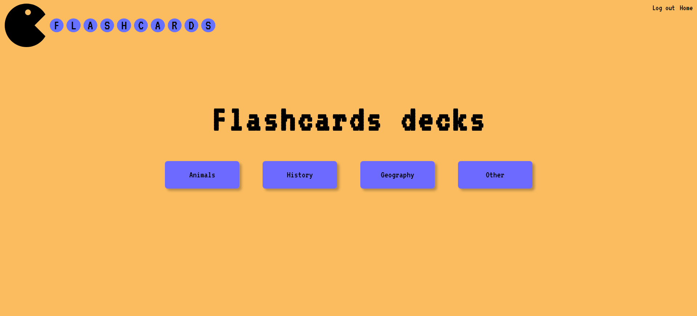
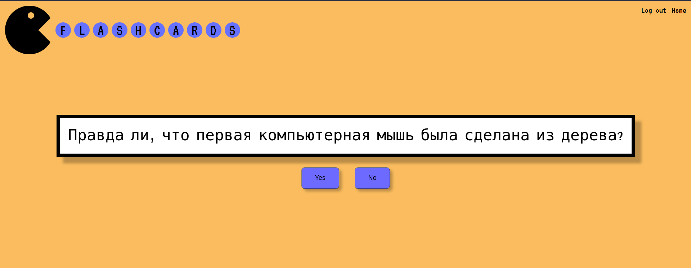

## Flashcards
# How to launch

1. Clone project
2. Install all dependencies in client/server with npm i
3. Creeate .env file in server folder
4. Migrate and seed DB in terminal.
5. Start with npm start